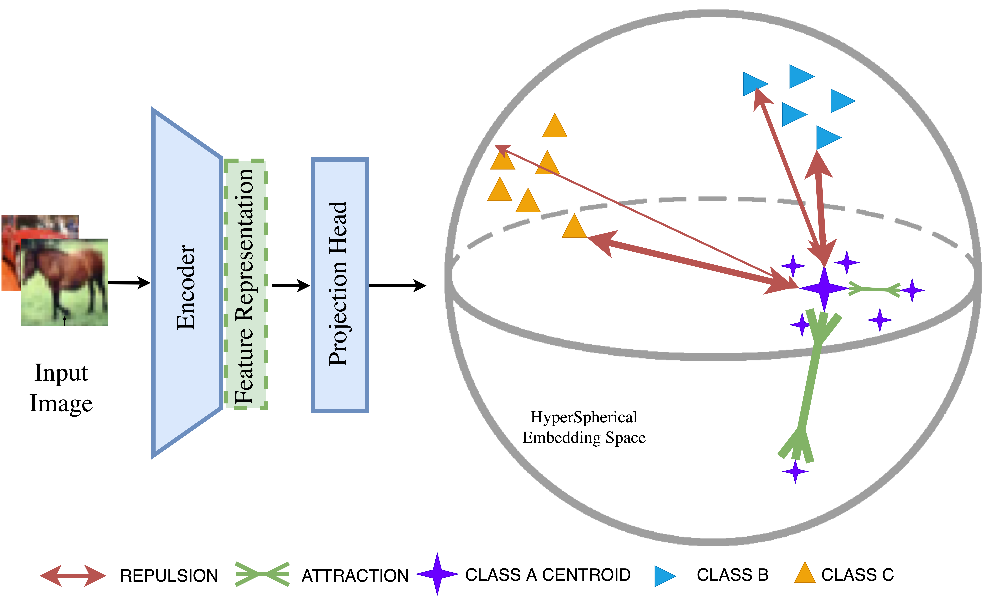

# ReweightOOD: Loss Reweighting for Distance-based OOD Detection 
This codebase provides a Pytorch implementation for the paper to appear at CVPRW-2024: "ReweightOOD: Loss Reweighting for Distance-based OOD Detection". It builds upon [OpenOOD](https://github.com/Jingkang50/OpenOOD).

## Abstract
Out-of-Distribution (OOD) detection is crucial for ensuring safety and reliability of neural networks in critical applications. Distance-based OOD detection is based on the assumption that OOD samples are mapped far from In-Distribution (ID) clusters in embedding space. A recent approach for obtaining OOD-detection-friendly embedding space has been contrastive optimization of pulling similar pairs and pushing apart dissimilar pairs. It assigns equal significance to all similarity instances with the implicit objective of maximizing the mean proximity between samples with their corresponding hypothetical class centroids. However, the emphasis should be directed towards reducing the Minimum Enclosing Sphere (MES) for each class and achieving higher inter-class dispersion to effectively mitigate the potential for ID-OOD overlap. Optimizing low-signal dissimilar pairs might potentially act against achieving maximal inter-class dispersion while less-optimized similar pairs prevent achieving smaller MES. Based on this, we propose a reweighting scheme ReweightOOD, that adopts the similarity optimization which prioritizes the optimization of less-optimized contrasting pairs while assigning lower importance to already well-optimized contrasting pairs. Such a reweighting scheme serves to minimize the MES for each class while achieving maximal inter-class dispersion. Experimental results on a challenging CIFAR100 benchmark using ResNet-18 network demonstrate that ReweightOOD outperforms supervised contrastive loss by a whopping 38% in the average FPR metric. In various classification datasets, our method provides a promising solution for enhancing OOD detection capabilities in neural networks.

## Method Illustration


## Datasets and Packages
Please download the datasets and required packages from [OpenOOD](https://github.com/Jingkang50/OpenOOD).

### Example Scripts for Training and Inference
Use the following scripts for training and inferencing the ReweightOOD model on different datasets:

- **CIFAR-10:**
  ```bash
  bash scripts/ood/reweightood/cifar10_train_reweightood.sh
  bash scripts/ood/reweightood/cifar10_test_reweightood.sh
  ```
- **CIFAR-100:**
  ```bash
  bash scripts/ood/reweightood/cifar100_train_reweightood.sh
  bash scripts/ood/reweightood/cifar100_test_reweightood.sh
  ```
- **ImageNet-200:**
  ```bash
  bash scripts/ood/reweightood/imagenet200_train_reweightood.sh
  bash scripts/ood/reweightood/imagenet200_test_reweightood.sh
  ```
- **ImageNet-1k:**
  ```bash
  bash scripts/ood/reweightood/imagenet_train_reweightood.sh
  bash scripts/ood/reweightood/imagenet_test_reweightood.sh
  ```

### Please consider citing our work if you find it useful.
```
@article{regmi2023reweightood,
  title={ReweightOOD: Loss Reweighting for Distance-based OOD Detection},
  author={Regmi, Sudarshan and Panthi, Bibek and Ming, Yifei and Gyawali, Prashnna Kumar and Stoyanov, Danail and Bhattarai, Binod},
  year={2023}
}
```
Also, please consider citing [OpenOOD](https://github.com/Jingkang50/OpenOOD) if you find this codebase useful.
